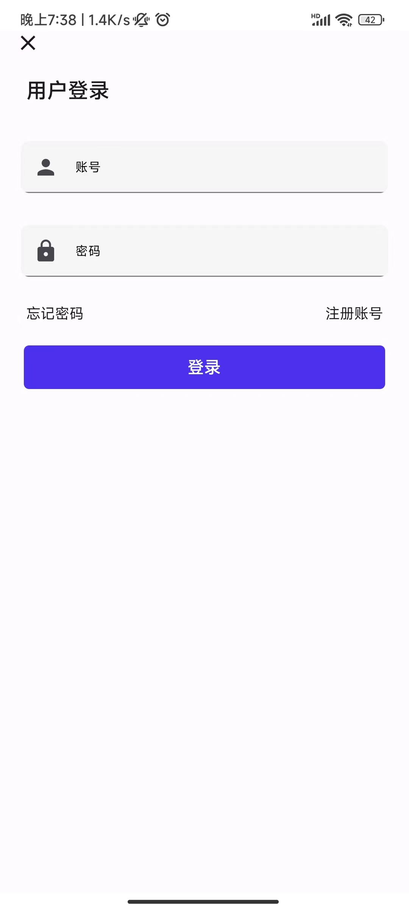
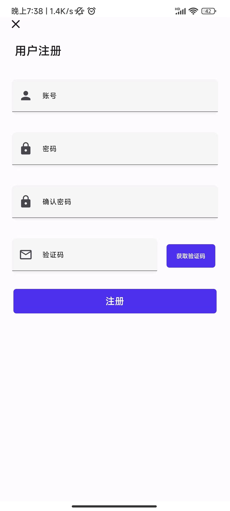
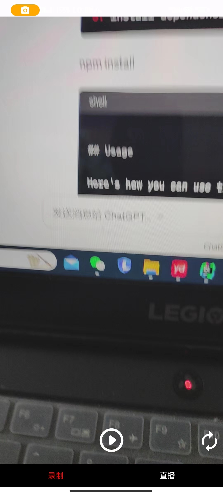

jetpack + compose + ffmpeg6.0 实现视频点播，推流 拉流功能
目录结构
com.fm.fmmedia/
│
├── api/           # 网络请求
├── compose/       # 公共一些库
├── dao/           # 数据库请求
├── resources/     # 资源文件目录
├── repository/    # 数据资源，主要请求网络交付给viewmodel
├── ui/            # 主要界面代码
├── viewModel/     # 数据更新操作

首页

登录界面

注册界面

视频录制

